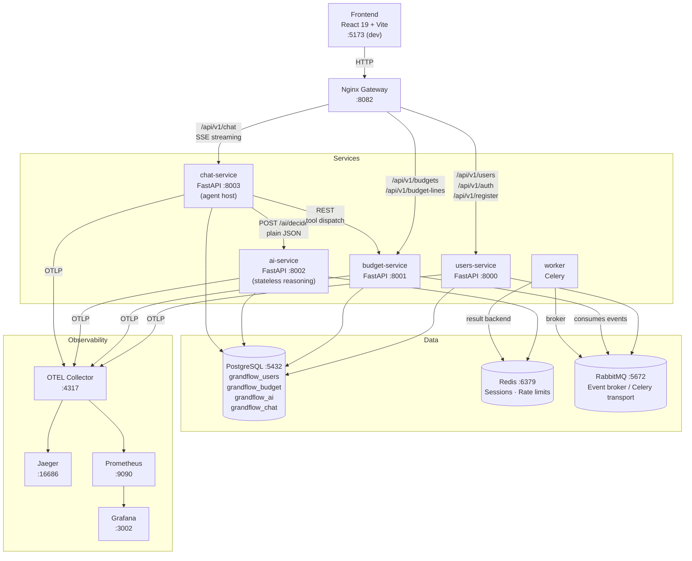

# GrantFlow

**Version:** 0.1.0 · **Last updated:** 2026-07-19

GrantFlow is an open-source platform for budget management and financial reporting in NGOs and donor organizations. It was born from 20 years of watching organizations manage grant budgets in incompatible Excel files — and a belief that modern software engineering can fix that.

> **Status:** Active development — not yet production-ready.

> **In-progress migration:** the AI chat stack is moving to a dedicated `chat-service` ("agent host") that owns conversation history and tool dispatch, so `ai-service` becomes pure stateless reasoning. This document describes the target architecture. Merged so far: #87–#90 (safety-net tests, frontend URL context, `shared/ai_client`, ai's `POST /ai/decide`). Next up: **#95 — retire ai's legacy chat stack** (`chat_routes.py`, `chat_orchestrator.py`, `chat_agent.py`, session tables). See [`openspec/changes/ai-chat-agent-host-migration/`](openspec/changes/ai-chat-agent-host-migration/) for the full proposal, design, and live task status.

→ **[Product Overview](docs/PRODUCT.md)** — what GrantFlow does, who it's for, and why it exists.

---

## Architecture



**Communication patterns:**
- Frontend → Services: via Nginx (single entry point at `:8082`)
- chat-service → ai-service: direct HTTP, stateless decision requests (`POST /ai/decide`) via `shared/ai_client`
- chat-service → budget-service: direct HTTP, curated tool dispatch (MCP-shaped registry; resource ids injected server-side, never supplied by the model)
- budget-service → users-service: direct HTTP (service discovery via env var)
- users-service → budget-service: RabbitMQ events (user created/updated)
- chat-service streams responses to the frontend via Server-Sent Events (SSE)
- Dependency DAG is acyclic by design: `frontend → chat`, `chat → ai`, `chat → domain REST`. No `ai → domain`, no `domain → domain`, no `domain → ai` — ai carries zero domain knowledge and every domain service can, in principle, be rewritten in another stack independently.

---

## Tech Stack

| Layer | Technology |
|---|---|
| Backend | Python 3.11+ · FastAPI 0.116 · Pydantic v2 |
| Frontend | React 19 · TypeScript 5.8 · Vite · TailwindCSS · TanStack Query |
| ORM | SQLAlchemy 2.0 (async) · Alembic migrations |
| Database | PostgreSQL 15 (one DB per service) |
| Cache | Redis 7 |
| Messaging | RabbitMQ 3 (aio-pika) |
| Auth | JWT (HS256) · refresh token rotation via Redis |
| AI | Anthropic API (BYOK) · Ollama (local dev) · pydantic-ai |
| Observability | OpenTelemetry (OTLP) · Jaeger · Prometheus · Grafana |
| Gateway | Nginx |
| Containerization | Docker · Docker Compose |
| CI | GitHub Actions (lint + tests per service) |

---

## Services

### users-service `:8000`
User and customer management, JWT authentication, role-based access control. Publishes `user.created` / `user.updated` events to RabbitMQ. Customers are modelled with `is_ngo` and `is_donor` boolean flags to support both sides of a grant relationship.

### budget-service `:8001`
Budget and budget-line CRUD. Consumes user events from RabbitMQ to maintain a local read model. Carries zero AI/chat knowledge — the parse-to-budget flow is driven by chat-service against this service's public REST API. Key endpoints:
- `POST /api/v1/budgets/with-lines` — atomic create: budget + all lines in one transaction
- Donor template mapping: detects and maps Excel donor budget formats to a normalized schema

### ai-service `:8002`
Pure stateless reasoning — no domain knowledge, no outbound calls to other services. `POST /ai/decide` takes a message, conversation history, tool JSON schemas, and domain context, and returns either a tool-call decision or a reply. Features:
- Provider abstraction: Ollama (dev) → Anthropic (prod, BYOK), switchable per-customer
- Per-customer rate limiting via Redis (default: 100 req/hour)
- Full audit log of every AI request (model, tokens, duration, success/failure)
- Prompt versioning: system and user prompts stored in DB, swappable without deploys

### chat-service `:8003`
Agent host — owns conversations and messages server-side (any-device chat history), the tool registry, and the dispatch loop. Serves `POST /chat/stream` (SSE) to the frontend and calls ai-service's `/ai/decide` for reasoning via `shared/ai_client`. Features:
- MCP-shaped tool registry (`list_tools()` / `call_tool()`): hand-curated budget toolset today, backed by an in-process FastMCP `from_openapi` bridge over budget's OpenAPI spec once the bridge ticket lands
- Deterministic guards in code: targeted tools require page context; resource ids (e.g. `budget_id`) are injected server-side from the URL context, never supplied by the model
- Parse-text-to-budget flow: consumes ai-service's parse stream, creates via budget's public REST, re-emits progress events to the frontend

### worker (Celery)
Background jobs shared across services — RabbitMQ as broker, Redis as result backend, per-domain queues (`ai`, `budget`, `users`). Currently runs a daily scheduled cleanup of expired AI sessions.

---

## Key Design Decisions

| Decision | Rationale |
|---|---|
| One PostgreSQL DB per service | Enforces service boundaries; avoids shared-schema coupling |
| Shared Python library (`/shared`) | Common JWT logic, Pydantic schemas, OpenTelemetry setup, and the `ai_client` decision-request library without duplication |
| RabbitMQ over direct HTTP for user events | Decouples budget-service from users-service availability |
| OpenTelemetry (OTLP) over Sentry | Vendor-agnostic; same instrumentation works with Jaeger today, any backend tomorrow |
| FastAPI async-first | All I/O (DB, Redis, HTTP, RabbitMQ) runs async; no sync blocking in the hot path |
| Nginx as single gateway | One CORS policy, one entry point; services are not directly exposed |
| Dedicated chat-service (agent host) over client-held history or ai-owned threads | Any-device chat history needs a server; keeps ai-service stateless and domain services free of chat plumbing |
| ai-service is pure stateless reasoning (`/ai/decide`), no outbound calls | Keeps the dependency DAG acyclic (`frontend → chat → {ai, domain REST}`); domain services stay swappable for another stack independently |
| Tool registry is MCP-shaped from day one | Same consumer-facing interface whether backed by hand-curated tools or the OpenAPI→MCP bridge — no breaking change when the bridge lands |

---

## Observability

All services export traces and metrics via OTLP to the OpenTelemetry Collector, which fans out to Jaeger (traces) and Prometheus (metrics). Grafana sits on top of Prometheus for dashboards.

Auto-instrumented via `shared/observability/__init__.py`:
- FastAPI request/response spans
- SQLAlchemy query spans
- Redis command spans (ai-service)

| Tool | URL | Purpose |
|---|---|---|
| Jaeger | http://localhost:16686 | Distributed traces, latency, error rates |
| Prometheus | http://localhost:9090 | Metrics queries and scrape targets |
| Grafana | http://localhost:3002 | Dashboards (admin / admin) |
| RabbitMQ UI | http://localhost:15672 | Queue inspection, message rates |

For more detail see [monitoring/README.md](monitoring/README.md).

---

## Running Locally

Two modes are available depending on the use case:

| | Dev mode | Local mode |
|---|---|---|
| **Use case** | Active development | Demo, testing, non-technical users |
| **Services** | Run on host (hot reload) | Run in Docker (no local deps needed) |
| **Entry point** | `./dev.sh` | `./local.sh` |
| **Frontend** | http://localhost:5173 | http://localhost:4000 |
| **Nginx gateway** | http://localhost:8082 | http://localhost:9082 |

---

### Dev mode

**Prerequisites:** Docker, Python 3.11+, Node.js 18+

Infrastructure runs in Docker; services run on the host for hot reload.

```bash
# 1. Start infrastructure (PostgreSQL, Redis, RabbitMQ, Nginx, observability)
./dev.sh up

# 2. Start each service in its own terminal
cd services/users  && alembic upgrade head && python -m uvicorn main:app --reload --port 8000
cd services/budget && alembic upgrade head && python -m uvicorn main:app --reload --port 8001
cd services/ai     && alembic upgrade head && python -m uvicorn main:app --reload --port 8002
cd services/chat   && alembic upgrade head && python -m uvicorn main:app --reload --port 8003

# 3. Start the frontend
cd frontend-typescript && npm install && npm run dev
```

**Dev mode endpoints:**

| | URL |
|---|---|
| Frontend | http://localhost:5173 |
| Nginx gateway | http://localhost:8082 |
| Users API docs | http://localhost:8000/docs |
| Budget API docs | http://localhost:8001/docs |
| AI API docs | http://localhost:8002/docs |
| Chat API docs | http://localhost:8003/docs |

**VSCode debugging** — each service exposes `debugpy` (enable with `VSCODE_DEBUGGER=1`):

| Service | debugpy port |
|---|---|
| users-service | 5678 |
| budget-service | 5680 |
| ai-service | 5682 |
| chat-service | 5684 |

Attach from VS Code with `"remoteRoot": "/app"`.

**Other `dev.sh` commands:**

```bash
./dev.sh down     # Stop infrastructure
./dev.sh logs     # Stream container logs
./dev.sh status   # Show container status
./dev.sh rebuild  # Rebuild images without cache
./dev.sh clean    # Stop and remove volumes
```

---

### Local mode

**Prerequisites:** Docker only

Everything runs in Docker — intended for demos, integration testing, or sharing with non-technical users.

```bash
./local.sh up
```

**Local mode endpoints:**

| | URL |
|---|---|
| Frontend | http://localhost:4000 |
| Nginx gateway | http://localhost:9082 |
| Users service | http://localhost:9000 |
| Budget service | http://localhost:9001 |

**Other `local.sh` commands:**

```bash
./local.sh down            # Stop all services
./local.sh logs [SERVICE]  # Stream logs (optionally for one service)
./local.sh status          # Show container status
./local.sh rebuild         # Rebuild images without cache
./local.sh clean           # Stop and remove volumes
./local.sh shell [SERVICE] # Open a shell in a container (default: users)
```

---

## Project Structure

```
GrantFlow/
├── .github/workflows/      # CI: lint + tests per service
├── docker/                 # Postgres init (creates 4 DBs)
├── docker-compose.dev.yml  # Infrastructure-only compose (dev mode)
├── docker-compose.yml      # Full containerized compose (prod)
├── dev.sh                  # Dev mode entry point
├── frontend-typescript/    # React + Vite + TypeScript app
├── monitoring/             # OTEL collector, Prometheus, Grafana configs
├── nginx/                  # Gateway config (dev + prod)
├── scripts/                # Utility scripts (issue creation, etc.)
├── shared/                 # Shared Python library
│   ├── ai_client/          # In-process client for ai-service's /ai/decide (retries, timeouts, decision parsing)
│   ├── db/                 # Audit mixin, custom column types
│   ├── observability/      # OpenTelemetry setup
│   ├── schemas/            # Pydantic schemas (cross-service)
│   ├── security/           # JWT utils, FastAPI auth dependencies
│   └── utils/              # HTTP client wrapper, currency service
└── services/
    ├── users/              # FastAPI: users, customers, auth
    ├── budget/             # FastAPI: budgets, budget lines
    ├── ai/                 # FastAPI: stateless LLM reasoning (/ai/decide), rate limiting, audit logs
    ├── chat/               # FastAPI: agent host — conversations, tool registry, dispatch loop, SSE streaming
    └── worker/             # Celery: background jobs (RabbitMQ broker, Redis result backend)
```

Each service follows the same internal layout:

```
service/
├── app/
│   ├── api/          # Route handlers
│   ├── crud/         # DB operations
│   ├── models/       # SQLAlchemy ORM models
│   ├── schemas/      # Pydantic request/response
│   ├── services/     # Business logic
│   └── core/         # Config, logging, exceptions
├── migrations/       # Alembic versions
├── tests/
└── main.py
```

---

## CI/CD

GitHub Actions runs on every push/PR touching a service or `shared/`:

| Workflow | Triggers | Steps |
|---|---|---|
| `users.yml` | `services/users/**`, `shared/**` | black · mypy · flake8 |
| `budget.yml` | `services/budget/**`, `shared/**` | pytest · black · mypy · flake8 |
| `ai.yml` | `services/ai/**`, `shared/**` | pytest · black · mypy · flake8 |
| `chat.yml` | `services/chat/**`, `shared/**` | pytest · black · mypy · flake8 |
| `worker.yml` | `services/worker/**` | black · flake8 · pytest |
| `shared.yml` | `shared/**` | black · flake8 · pytest (`shared/ai_client`, `shared/tests`) |
| `frontend.yml` | `frontend-typescript/**` | vitest (with coverage) |

---

## Contributing

1. Fork the repo and create a branch: `git checkout -b feature/your-feature`
2. Run the relevant service tests: `cd services/<service> && pytest`
3. Run linters: `black . && mypy . && flake8`
4. Open a pull request

---

## License

GNU AGPL v3 — see [LICENSE](./LICENSE).
